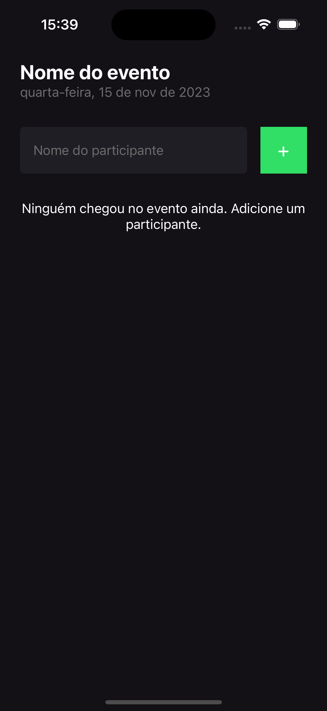

### Projeto I'm Here

- Utilizando fundamentos de React Native.


Este projeto foi criado com `nodeJS v18.12.0` e `npm v8.19.2` utilizando template `Blank with Typescript`.

```bash
npx create-expo-app `projectName` --template
```

Para iniciar o projeto é necessário que o simulador do dispositivo esteja em execução, nesse caso, deve se iniciar (iOS -Simulador / android AVD)

```bash
npx expo start
```

<!-- _Tela inicial_ -->


Sequencialmente, da esquerda para direita você pode acompanhar o fluxo de funcionamento da aplicação.

Esta aplicação, funciona com armazenamento de dados em memória e além disso, foi implementado um texto dinâmico conforme o dia atual, através da biblioteca `moment`.
